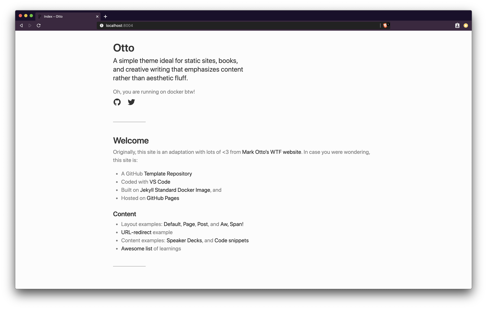

# The Otto Theme :lock:

Originally, an adaptation from [Mark Otto's WTF website](http://wtfhtmlcss.com/), with lots of :heart: of course. 



> Visit [kosalanuwan.github.io](https://kosalanuwan.github.io) or linked sites to see flavours of this template in action.

In case you were wondering, full-blown configurations found in:

- `.vscode/extensions.json` has minimal extensions required
- `.vscode/tasks.json` has the tasks to run from source locally
- `.devcontainer` has configurations to develop in a containerized environment
- `_config.yml` requires for jekyll to build and publish the site
- `.devcontainer/_config.devcontainer.yml` requires to override jekyll build configurations to run locally
- `Gemfile` requires for ruby to intall runtime dependencies and plugins
- `_data/website.yml` has website settings, features flags, author, navigation, et al. content related resources that got nothing to do with jekyll configurations

## Run from Source

You want to have followings installed:
- [VS Code](https://code.visualstudio.com/) and [recommended extensions](.vscode/extensions.json)
- [Docker Desktop app](https://www.docker.com/products/docker-desktop)
- [Git](https://git-scm.com/downloads)

```sh
#!/bin/bash
gh repo clone gh-site-otto-theme
code gh-site-otto-theme
```

First, you want [to _Reopen in Container_](https://code.visualstudio.com/docs/remote/containers-tutorial) that will install all required jekyll plugins, [then _Run Test Task_](https://code.visualstudio.com/docs/getstarted/tips-and-tricks#_task-runner) to launch the site on your favorite browser [localhost:8004](http://localhost:8004).

## Build and Publish

You want to have a look at [gh-site-*](https://github.com/kosalanuwan?tab=repositories&q=gh-site-) repos to see how the ci/cd pipelines have been set up.

## Feedback

Questions, comments, bugs, et al are pointed to [AMA](https://github.com/kosalanuwan/ama) repository.

## License

Copyright (c) Kosala Nuwan Perera. All rights reserved.

The design and the source is not open sourced.